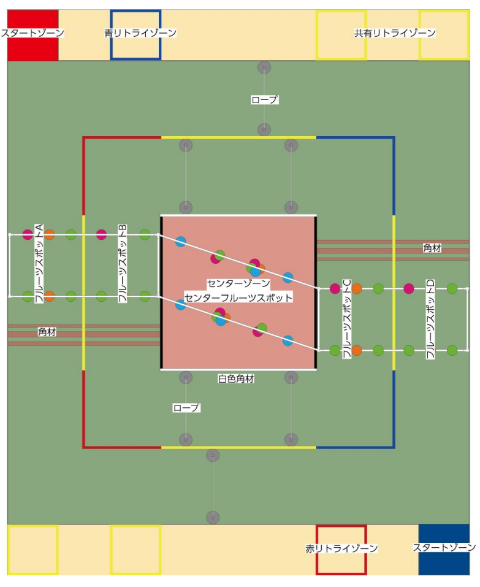
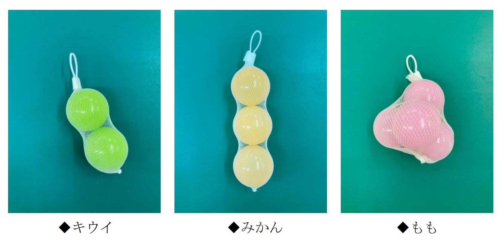
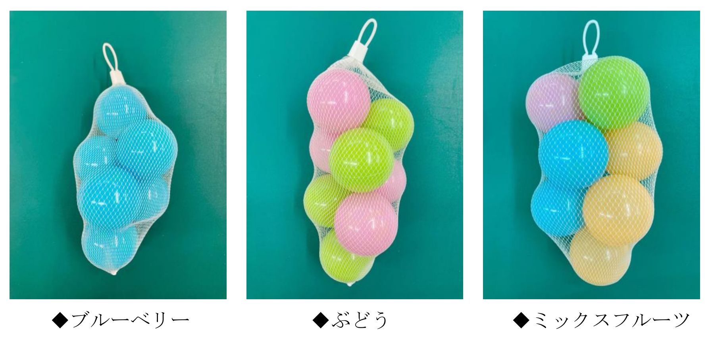

# もぎもぎ! フルーツ GO ラウンド

ロボコンの公式発表をまとめた非公式の文書です!

> 
> [https://official-robocon.com/robocon_wp/wordpress/wp-content/uploads/2023/04/kosen_rule_230427.pdf.pdf](https://official-robocon.com/robocon_wp/wordpress/wp-content/uploads/2023/04/kosen_rule_230427.pdf.pdf)

## 基本情報

## エリア

- 9000x9000

### スタートゾーン

- 1000x1000
- フルーツカゴはこの周辺のフィールド外に置く

### リトライゾーン

- 1000x1000
- 共有 4,個別 2

### ランゾーン

- 反時計回り
- センターライン有
  - w=50
  - コーナーでのみコース変更可(優先制度有)

### センターゾーン

- 3000x3000
- 角材(50)で囲まれてる

## フルーツ

### フルーツスポット A~B

- キウイ:3
  - h=1400
- みかん:2
  - h=1700
- もも:1
  - h=1800

h={🍊 最下部と床との距離}

>  
> [https://official-robocon.com/robocon_wp/wordpress/wp-content/uploads/2023/04/kosen_rule_230427.pdf.pdf](https://official-robocon.com/robocon_wp/wordpress/wp-content/uploads/2023/04/kosen_rule_230427.pdf.pdf)

### センターフルーツスポット

- ブルーベリー:4
  - h=2000
  - n=6
- ぶどう:2
  - h=~~2300~~ <mark>2200</mark>
  - n=8
- ミックスフルーツ:2
  - h=~~2500~~ <mark>2400</mark>
  - n=10

>  
> [https://official-robocon.com/robocon_wp/wordpress/wp-content/uploads/2023/04/kosen_rule_230427.pdf.pdf](https://official-robocon.com/robocon_wp/wordpress/wp-content/uploads/2023/04/kosen_rule_230427.pdf.pdf)

## 障害物

_詳細は後日発表_

### ロープ

- コース内両端にポール
- in コース:2, out コース 1
- φ=12, 綿
- 予選
  - hmin=100
  - hmax=600
- 本選
  - hmin=100
  - hmax=300

### 角材

- 予選
  - ~~70,100,50~~ <mark>75,90,60</mark>
- 本選
  - ~~50,100,70,100,50~~ <mark>60,90,75,90,60</mark>
- d=90

## 競技の進行

1. ピットクル+メンバー 3 名がロボットとフルーツカゴを置く
2. セッティングタイム(1:00)
3. 競技開始(2:30)
   - フルーツカゴへの移し入れはメンバーが行うのも可
4. お助けアイテムの使用(2 週目以降)
5. センターゾーンへの出入り(2 週目以降)
   - 白色角材からのみ可

## 得点

- 1:取って保持
- 取って、フルーツカゴに入れる
  - 10:キウイ
  - 20:みかん
  - 30:もも
  - 40:ブルーベリー
  - 50:ぶどう
  - 70:ミックスフルーツ

## 勝敗

- 点数の高いチームが勝利
  
  - 同点の場合
    1. ミックスフルーツをフルーツカゴに入れたチーム
    2. より多くの種類をフルーツカゴに入れたチーム

- 2:30

## ロボット

- 青,赤の目印
- 最大サイズ: 800x800x1600(h)
- ≦30kg
- 緊急停止スイッチ,LED
- **駆動系**
  - ≦24V
  - ≦30A

## お助けアイテム

- {三辺の合計}≦2000
- {1 辺}≧10
- ≦1kg
- 化学物質,液体は不可
- **動力**
  - 電力・アクチュエーターの搭載は不可
  - 自発的に動作しないもの,ゴム,バネは可

## 元文書

### ルールブック

#### 2023/04/27公開

> https://official-robocon.com/robocon_wp/wordpress/wp-content/uploads/2023/04/kosen_rule_230427.pdf.pdf

#### 2023/05/31公開

> [https://official-robocon.com/robocon_wp/wordpress/wp-content/uploads/2023/05/【0531修正】高専ロボコン2023ルールブック.pdf](https://official-robocon.com/robocon_wp/wordpress/wp-content/uploads/2023/05/%E3%80%900531%E4%BF%AE%E6%AD%A3%E3%80%91%E9%AB%98%E5%B0%82%E3%83%AD%E3%83%9C%E3%82%B3%E3%83%B32023%E3%83%AB%E3%83%BC%E3%83%AB%E3%83%96%E3%83%83%E3%82%AF.pdf)

### フィールド図面

### 2023/05/26公開

> [https://official-robocon.com/robocon_wp/wordpress/wp-content/uploads/2023/05/高専ロボコン2023フィールド図面0526.pdf](https://official-robocon.com/robocon_wp/wordpress/wp-content/uploads/2023/05/%E9%AB%98%E5%B0%82%E3%83%AD%E3%83%9C%E3%82%B3%E3%83%B32023%E3%83%95%E3%82%A3%E3%83%BC%E3%83%AB%E3%83%89%E5%9B%B3%E9%9D%A20526.pdf)

### フィールドイメージ図

> [https://official-robocon.com/robocon_wp/wordpress/wp-content/uploads/2023/05/高専ロボコン2023フィールドイメージ図0526.pdf](https://official-robocon.com/robocon_wp/wordpress/wp-content/uploads/2023/05/%E9%AB%98%E5%B0%82%E3%83%AD%E3%83%9C%E3%82%B3%E3%83%B32023%E3%83%95%E3%82%A3%E3%83%BC%E3%83%AB%E3%83%89%E3%82%A4%E3%83%A1%E3%83%BC%E3%82%B8%E5%9B%B30526.pdf)

### フルーツスポット・パーツ図面

> [https://official-robocon.com/robocon_wp/wordpress/wp-content/uploads/2023/05/高専ロボコン2023フルーツスポット・パーツ図面_0531.pdf](https://official-robocon.com/robocon_wp/wordpress/wp-content/uploads/2023/05/%E9%AB%98%E5%B0%82%E3%83%AD%E3%83%9C%E3%82%B3%E3%83%B32023%E3%83%95%E3%83%AB%E3%83%BC%E3%83%84%E3%82%B9%E3%83%9D%E3%83%83%E3%83%88%E3%83%BB%E3%83%91%E3%83%BC%E3%83%84%E5%9B%B3%E9%9D%A2_0531.pdf)
